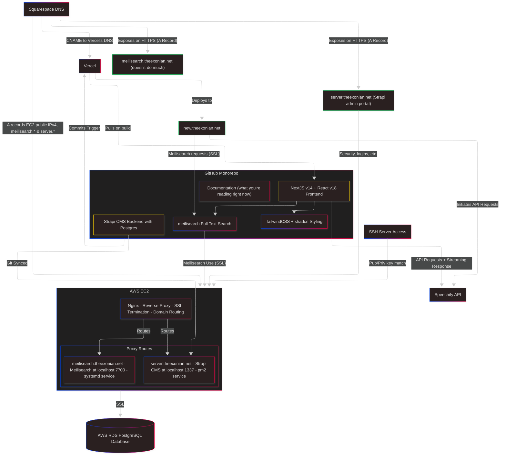

# Tech Stack Diagram

> [!TIP]
> Plug this mermaid markdown diagram into [https://mermaid.live/](https://mermaid.live/) or similar for an organized view

```mermaid
---
config:
  theme: neo-dark
  look: neo
  layout: elk
---
flowchart TB
 subgraph ProxyRoutes["Proxy Routes"]
        MeilisearchProxy["meilisearch.theexonian.net - Meilisearch at localhost:7700 - systemd service"]
        StrapiProxy["server.theexonian.net - Strapi CMS at localhost:1337 - pm2 service"]
  end
 subgraph NginxProxy["AWS EC2"]
    direction TB
        NginxConfig["Nginx - Reverse Proxy - SSL Termination - Domain Routing"]
        ProxyRoutes
  end
 subgraph GitHub["GitHub Monorepo"]
    direction TB
        frontend["NextJS v14 + React v18 Frontend"]
        backend["Strapi CMS Backend with Postgres"]
        n4["TailwindCSS + shadcn Styling"]
        n5["meilisearch Full Text Search"]
        documentation["Documentation (what you're reading right now)"]
  end
    NginxConfig -- Routes --> MeilisearchProxy & StrapiProxy
    Vercel["Vercel"] -- Deploys to --> NewSite["new.theexonian.net"]
    Squarespace["Squarespace DNS"] -- "A records EC2 public IPv4, meilisearch.* & server.*" --> NginxProxy
    Squarespace -- CNAME to Vercel's DNS --> Vercel
    frontend --> n4 & n5
    frontend -- API Requests + Streaming Response --> n7["Speechify API"]
    n5 -- Meilisearch Use (SSL) --> NginxProxy
    NewSite -- Meilisearch requests (SSL) --> n5
    GitHub -- Commits Trigger --> Vercel
    NewSite -- Initiates API Requests --> n7
    Squarespace -- Exposes on HTTPS (A Record) --> n8["server.theexonian.net (Strapi admin portal)"] & n9["meilisearch.theexonian.net (doesn't do much)"]
    n8 -- "Security, logins, etc." --> NginxProxy
    NginxProxy -- SSL --> AWSRds[("AWS RDS PostgreSQL Database")]
    Vercel -- Pulls on build --> frontend
    backend -- Git Synced --> StrapiProxy
    SSH["SSH Server Access"] -- Pub/Priv key match --> NginxProxy
    style frontend stroke:#FFD600
    style backend stroke:#FFD600
    style NewSite stroke:#00C853
    style n8 stroke:#00C853
    style n9 stroke:#00C853
```
